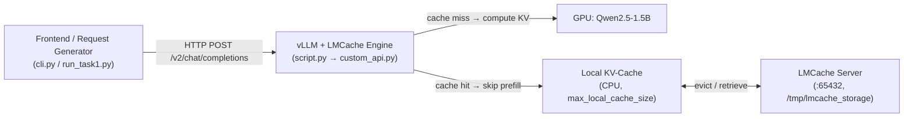

# 🎯 IK2221 Project — Task 1 Demo Cheatsheet

> [!NOTE]
> **运行环境**: KTH JupyterHub 远程 GPU 服务器
> - URL: `https://gpu1.eecs.kth.se/user/hanyin/lab/`
> - 项目路径: `~/shared/ik2221_project2/`
> - 用户: `jovyan@jupyter-hanyin`
> - 所有命令在 **JupyterLab 的 Terminal** 中执行（点 `+` 按钮 → Terminal 打开新终端）

## 📋 目录
1. [系统架构总览](#1-系统架构总览)
2. [启动流程 (JupyterLab 多终端)](#2-启动流程)
3. [核心代码走读](#3-核心代码走读)
4. [Q1: Prompt 长度 vs 响应时间](#4-q1-prompt-长度-vs-响应时间)
5. [Q2: Cache 命中 — 重复请求加速](#5-q2-cache-命中--重复请求加速)
6. [Q3: 请求多样性的影响](#6-q3-请求多样性的影响)
7. [已有实验结果速查](#7-已有实验结果速查)
8. [预期 Demo/答辩问题 & 回答](#8-预期-demo答辩问题--回答)

---

## 1. 系统架构总览



**三个核心组件：**

| 组件 | 作用 | 代码位置 |
|------|------|----------|
| **LMCache Server** | 远程 KV cache 存储，扩展 GPU 之外的缓存容量 | `lmcache-server/lmcache_server/server.py` |
| **vLLM + LMCache Engine** | LLM 推理引擎 + 本地 KV cache 管理 | `lmcache-vllm-extended/lmcache_vllm/script.py` |
| **Frontend / Benchmark** | 用户界面 or 自动化实验脚本 | `frontend/frontend.py`, `benchmark/run_task1.py` |

> [!IMPORTANT]
> Task 1 的核心是：**baseline scheduler** — 不做任何重排序，按原始顺序转发请求。关注的是 KV cache 本身对推理性能的影响。

---

## 2. 启动流程

> [!NOTE]
> 以下所有命令在 **JupyterLab** 中执行。通过点击左上角 **`+`** 按钮 → 选择 **Terminal** 来打开多个终端标签。
> 项目根目录: `~/shared/ik2221_project2/`
> 先进入项目目录并激活虚拟环境: `cd ~/shared/ik2221_project2 && source ./venv/bin/activate`

### Terminal 1：LMCache Server
```bash
cd ~/shared/ik2221_project2
source ./venv/bin/activate
cd lmcache-server
python3 -m lmcache_server.server 127.0.0.1 65432 /tmp/lmcache_storage
```

**预期输出 & 解读：**
```
INFO LMCache: Initializing disk-only cache server    ← ① 初始化磁盘缓存后端 (/tmp/lmcache_storage)
Server started at 127.0.0.1:65432                    ← ② Server 就绪，在 65432 端口监听
Connected by ('127.0.0.1', 56288)                    ← ③ vLLM Engine (Terminal 2) 连上来了
```

| 输出行 | 含义 | Demo 讲解 |
|:---|:---|:---|
| `Initializing disk-only cache server` | Server 使用 **磁盘** 存储被驱逐的 KV cache | 远程存储层，扩展 GPU 之外的缓存容量 |
| `Server started at 127.0.0.1:65432` | TCP socket 就绪，等待 LMCache Engine 连接 | 端口号必须与 `configuration.yaml` 中 `remote_url` 一致 |
| `Connected by (...)` | vLLM 启动后自动连接此 Server | **这行出现在启动 Terminal 2 之后** — 说明两个组件已握手成功 |

- 启动后终端会阻塞等待连接 — **保持此终端开着**
- 如果看到 `Connected by` 说明 Terminal 2 的 vLLM + LMCache Engine 已成功连接

### Terminal 2：vLLM + LMCache Engine（点 `+` → Terminal 新开一个标签）
```bash
cd ~/shared/ik2221_project2
source ./venv/bin/activate
export PYTORCH_CUDA_ALLOC_CONF=expandable_segments:True

LMCACHE_CONFIG_FILE=lmcache-vllm-extended/configuration.yaml \
CUDA_VISIBLE_DEVICES=0 \
python lmcache-vllm-extended/lmcache_vllm/script.py serve \
  Qwen/Qwen2.5-1.5B-Instruct \
  --gpu-memory-utilization 0.6 \
  --dtype half \
  --port 8000 \
  --max-model-len 2048 \
  --guided-decoding-backend lm-format-enforcer
```

**预期输出（关键行）& 解读：**
```
Route: /v1/chat/completions, Methods: POST       ← 标准 OpenAI 兼容接口
Route: /v2/chat/completions, Methods: POST       ← 扩展接口 (Task 1 使用)
Route: /v2/batch/chat/completions, Methods: POST ← 批量接口 (Task 2 使用)
Uvicorn running on http://0.0.0.0:8000           ← vLLM API 就绪
```

| 输出行 | 含义 | Demo 讲解 |
|:---|:---|:---|
| `/v1/chat/completions` | vLLM 原生 OpenAI 兼容端点 | 标准单请求推理接口 |
| `/v2/chat/completions` | `custom_api.py` 注册的**扩展端点** | Task 1 实验脚本调用此端点，内部走 baseline scheduler |
| `/v2/batch/chat/completions` | Task 2 的**批量推理端点** | 接收一批请求 → scheduler 重排序 → 逐一执行 |
| `Uvicorn running on :8000` | HTTP 服务就绪 | **看到此行即可启动 Terminal 3/4**；同时 Terminal 1 会出现 `Connected by` |

> [!TIP]
> 启动 Terminal 2 需要约 **1-2 分钟**（加载模型到 GPU）。看到 `Uvicorn running on http://0.0.0.0:8000` 后才代表服务完全就绪。

### Terminal 3：Frontend 验证（点 `+` → Terminal 新开一个标签）
```bash
cd ~/shared/ik2221_project2
source ./venv/bin/activate
cd lmcache-vllm-extended/frontend
streamlit run frontend.py --server.port 8501
```
**预期输出 & 解读：**
```
You can now view your Streamlit app in your browser.

  Local URL: http://localhost:8501          ← ❌ 容器内部，外部无法直接访问
  Network URL: http://10.244.2.189:8501    ← ❌ K8s Pod 内网 IP，外部不可达
  External URL: http://130.237.20.250:8501 ← ❌ 被防火墙限制，也无法直接访问
```

> [!WARNING]
> 以上三个 URL 都**无法直接在浏览器打开**！必须通过 JupyterHub proxy 访问：

**✅ 正确访问方式**（通过 JupyterHub proxy）：
```
https://gpu1.eecs.kth.se/user/hanyin/proxy/8501/
```

或使用 **CLI 模式**（不需要浏览器访问）:
```bash
cd ~/shared/ik2221_project2/lmcache-vllm-extended/frontend
python cli.py --context context.txt
```

### `configuration.yaml` 关键参数（路径: `~/shared/ik2221_project2/lmcache-vllm-extended/configuration.yaml`）
```yaml
chunk_size: 256              # KV cache 分块大小 (tokens)
local_device: "cpu"          # 本地 cache 存储设备
max_local_cache_size: 0.1    # 本地 cache 容量 (GB) ← 实验中会修改此值
remote_url: "lm://127.0.0.1:65432"  # 远程 server 地址
remote_serde: "safetensor"   # 序列化格式
```

> [!WARNING]
> 修改 `max_local_cache_size` 后，必须在 **Terminal 2 中 Ctrl+C 终止 vLLM 并重新启动**才能生效！Terminal 1 的 LMCache Server 不需要重启。

---

## 3. 核心代码走读

### 3.1 Request Generator — `~/shared/ik2221_project2/lmcache-vllm-extended/benchmark/request_generator.py`

**核心数据结构：**

```python
@dataclass(frozen=True)
class InferenceRequest:
    request_id: str             # e.g., "req-0001"
    context_id: str             # e.g., "vllm", "cacheblend" (来自 txt 文件名)
    question: str               # 问题文本
    context_text: str           # paper summary 全文
    sequence_index: int         # 在 schedule 中的位置
    experiment: str             # "length" / "repeat" / "diversity"
    visit_type: VisitType       # "first" / "exact_repeat" / "gap"
    prompt_token_count: int     # tokenizer 计算的 token 数
    source_request_id: str      # exact_repeat 指向原始 request
```

**消息格式 (发送给 LLM 的)：**
```python
def to_messages(self):
    return [
        {"role": "user", "content": f"{SYSTEM_PROMPT}\n\n{self.context_text}"},
        {"role": "assistant", "content": "Got it!"},
        {"role": "user", "content": self.question},
    ]
```
→ 系统 prompt + paper 全文 + 问题，三轮对话格式

**数据来源：** `frontend/data/` 下 14 篇 paper summaries (txt)

| Paper 文件名 | 大致内容 |
|:---|:---|
| `vllm.txt` | PagedAttention, vLLM 高吞吐 serving |
| `cacheblend.txt` | CacheBlend KV cache reuse in RAG |
| `osdi24-agrawal.txt` / `osdi24-lee.txt` / `osdi24-sun-biao.txt` | OSDI'24 系统论文 |
| `sigcomm24-crux.txt` / `sigcomm2023_janus.txt` | SIGCOMM 网络论文 |
| `click.txt` / `nsdi20-paper-barbette.txt` | 经典网络系统 |
| 等共 14 篇 | ... |

### 3.2 实验主脚本 — `~/shared/ik2221_project2/lmcache-vllm-extended/benchmark/run_task1.py`

**核心函数：**

```python
def run_single_request(client, model, req, *, max_tokens, temperature):
    """Stream 请求；记录 TTFT 和 full response time。"""
    t0 = time.perf_counter()
    stream = client.chat.completions.create(
        model=model, messages=req.to_messages(),
        max_tokens=max_tokens, temperature=temperature,
        stream=True, stop=["\n"],
    )
    ttft = None
    for chunk in stream:
        delta = chunk.choices[0].delta.content
        if delta and ttft is None:
            ttft = time.perf_counter() - t0   # ← Time To First Token
    response_time = time.perf_counter() - t0   # ← Full response time (prefill + decode)
```

**两个关键指标：**
- **TTFT** (Time To First Token)：从请求发出到收到第一个 token 的时间 → 主要反映 **prefill 阶段**
- **Full Response Time**：从请求发出到所有 token 生成完毕 → 包括 prefill + decode

### 3.3 Baseline Scheduler — `~/shared/ik2221_project2/lmcache-vllm-extended/lmcache_vllm/custom_api.py`

Task 1 使用的 `/v2/chat/completions` 端点 → **直接转发**，不做重排序：
```python
@extended_router.post("/chat/completions")
async def create_chat_completion(request, raw_request):
    return await base_api.create_chat_completion(request, raw_request)
```

---

## 4. Q1: Prompt 长度 vs 响应时间

### 题目要求
> *What happens to the latency as the combined context + question length increases? Plot a graph showing the relationship between sequence length and response time.*

### 实验设计
- 14 篇 paper 各发 1 个请求 (不同 paper 有不同长度)
- 按 prompt token 数排序发送
- 跳过 1 个 warmup 请求
- 记录 full response time

### 运行命令
```bash
# Terminal 4 — 实验终端（点 + → Terminal 再开一个标签）
cd ~/shared/ik2221_project2
source ./venv/bin/activate
python lmcache-vllm-extended/benchmark/run_task1.py q1 --cache-gb 0.2
```

### 关键代码逻辑 (`lmcache-vllm-extended/benchmark/run_task1.py` 约第 473-516 行)

```python
def run_q1(args: argparse.Namespace) -> None:
    preset = PRESETS["q1"]
    # 1. 构建 "length" 模式的调度：每篇 paper 生成 1 个请求
    schedule = build_schedule(
        preset["kind"],
        args.data_dir,
        ...
    )
    ...
    # 2. 按 prompt token 长度排序，从而能在图表中画出清晰的上升趋势线
    # Sorted by length → clearer trend; reduces random cache-order noise
    schedule.requests.sort(
        key=lambda r: r.prompt_token_count or 0
    )
    ...
    # 3. 按照排序好的序列逐一发送请求给 LLM 并记录耗时
    payload = run_schedule(
        schedule,
        api_base=args.api_base,
        ...
        warmup=preset["warmup"],
        question="q1",
        ...
    )
```

### 生成的图表
- **输出**: `benchmark/results/q1_cache0.2.png`
- **X 轴**: Prompt length (tokens)
- **Y 轴**: Full response time (s)
- 带线性拟合趋势线

### 💬 Demo 解释要点
- Prompt 越长 → 需要计算的 KV 越多 → prefill 时间线性增长
- 更长的 context → 更多的 attention 计算 → O(n²) 但实践中近似线性
- 即使有 cache, 如果是 **首次** 请求，KV 仍需完全计算

---

## 5. Q2: Cache 命中 — 重复请求加速

### 题目要求
> *What happens if an old (previously seen) request is fed again to the model? Are the performances better? Analyze how the size of the local cache affects these results.*

### 实验设计

#### 实验 A: Back-to-back repeat (立即重复)
- 每篇 paper 的每个问题: 先发 first → 紧接着发 exact_repeat
- 相同 context + 相同 question → KV cache 应该被 100% 复用

#### 实验 B: Two-phase repeat (间隔重复)
- Phase A: 14 篇 paper 各 1 个 first 请求 (打乱顺序)
- Phase B: 按相同顺序重发 14 个 exact_repeat
- 中间间隔其他请求 → cache 可能被驱逐

### 运行命令
```bash
# 在 Terminal 4（实验终端）:
cd ~/shared/ik2221_project2
source ./venv/bin/activate

# 实验 A: 立即重复
python lmcache-vllm-extended/benchmark/run_task1.py q2 --cache-gb 0.2

# 实验 B: 间隔重复
python lmcache-vllm-extended/benchmark/run_repeat_gap.py --cache-gb 0.2
```

### Cache sweep (改变本地 cache 大小)
```bash
# 1. 在 JupyterLab 文件浏览器中打开 lmcache-vllm-extended/configuration.yaml
#    修改 max_local_cache_size: 0.05
# 2. 在 Terminal 2 中 Ctrl+C 终止 vLLM，然后重新执行启动命令
# 3. 运行实验
python lmcache-vllm-extended/benchmark/run_task1.py q2 --cache-gb 0.05  # 在 Terminal 4

# 重复以上步骤, 分别设置 0.1, 0.2, 0.4 GB
# 当 ≥2 个 q2_cache*.json 存在时，自动生成 q2_cache_sweep.png
```

### 关键代码逻辑

**repeat schedule 构建** (`.../benchmark/request_generator.py` 约第 271-330 行)
```python
def build_repeat_schedule(
    contexts: dict[str, str],
    ...
) -> RequestSchedule:
    ...
    # 1. 打乱所有的 (context, question) 基础请求对
    base = _base_requests(
        contexts, requests_per_context=requests_per_context, experiment="repeat"
    )
    rng.shuffle(base)

    all_reqs: list[InferenceRequest] = []
    idx = 0
    # 2. 遍历打乱后的请求，对每一个请求，先发一次 first，紧接着立刻发一次 exact_repeat
    for src in base:
        first_id = f"req-{idx:04d}"
        all_reqs.append(
            InferenceRequest(
                ...
                visit_type="first", # 第一次请求，会引发 cache miss
            )
        )
        all_reqs.append(
            InferenceRequest(
                ...
                visit_type="exact_repeat", # 立即重复的请求，应该 100% cache hit
                source_request_id=first_id,
            )
        )
        idx += 2
    ...
```

**two-phase repeat** (`.../benchmark/request_generator.py` 约第 333-386 行)
```python
def build_repeat_two_phase_schedule(
    contexts: dict[str, str],
    ...
) -> RequestSchedule:
    ...
    # Phase A: 发送所有论文的第一遍请求（顺序已完全打乱）
    phase_a: list[InferenceRequest] = []
    for i, src in enumerate(base):
        phase_a.append(
            _make_request(i, src.context_id, src.context_text, src.question, "repeat_gap", "first")
        )

    # Phase B: 按照 Phase A 完全相同的顺序，再发一遍重复请求
    # 这意味着同一篇论文的两次请求之间，隔了另外 13 篇论文的请求！考察 cache 是否存活
    phase_b: list[InferenceRequest] = []
    for i, src in enumerate(phase_a):
        phase_b.append(
            InferenceRequest(
                ...
                visit_type="exact_repeat",
                source_request_id=src.request_id,
            )
        )
    ...
```

### 生成的图表
- `q2_cache0.2.png` — 左：逐个对比 first vs repeat；右：平均值
- `q2_cache_sweep.png` — 不同 cache size 下的 throughput 和 first/repeat latency
- `repeat_gap_cache0.2.png` — two-phase 模式的对比

### 💬 Demo 解释要点
- **立即重复**: repeat 的 TTFT 显著降低（cache hit → 跳过 prefill）
- **间隔重复**: 取决于 cache 容量 — 容量够大 → 仍有加速；容量小 → cache 被驱逐, 无加速
- **cache size 影响**: 越大的 cache → 能保存越多 context 的 KV → 重复请求加速越明显
- **Full response time 差异可能不大**：因为 decode 阶段时间占比高，prefill 加速有限

### 已有数据 (cache=0.2GB, back-to-back)
```
avg response time first  = 0.614 s
avg response time repeat = 0.599 s
TTFT first               = 0.089 s
TTFT repeat              = 0.074 s   ← cache hit 效果
speedup (TTFT)           ≈ 1.2x
```

---

## 6. Q3: 请求多样性的影响

### 题目要求
> *What happens to the performance when the diversity of the requests increases?*

### 实验设计 — 三种 diversity 级别

| Level | 策略 | adjacent same-context pairs | 含义 |
|:---:|:---|:---:|:---|
| **low** | 按 context 分组 (A-q1, A-q2, B-q1, B-q2, ...) | 最高 (13/27) | 最大 cache 复用 |
| **medium** | 全部打乱 (Figure 4 stream) | 中等 (~2/27) | 随机 |
| **high** | round-robin (A-q1, B-q1, ..., A-q2, B-q2, ...) | 最低 (0/27) | 最小 cache 复用 |

- 每个 level 都是 **28 个请求** (14 papers × 2 questions)
- 仅改变请求顺序

### 运行命令
```bash
# 在 Terminal 4（实验终端）:
cd ~/shared/ik2221_project2
source ./venv/bin/activate
python lmcache-vllm-extended/benchmark/run_task1.py q3 --cache-gb 0.2
```

### 关键代码逻辑 (`lmcache-vllm-extended/benchmark/request_generator.py` 约第 490-557 行)

```python
def build_diversity_schedule(
    contexts: dict[str, str],
    level: DiversityLevel,
    ...
) -> RequestSchedule:
    ...
    if level == "low":
        # Low 级别: 相同 context 的请求排在一起 (如: A-q1, A-q2, B-q1, B-q2)，命中率最高
        reqs = _base_requests(
            contexts,
            ...
        )
        ...
    elif level == "medium":
        # Medium 级别: 所有的请求完全随机打乱
        reqs = _base_requests(
            contexts,
            ...
        )
        rng.shuffle(reqs)
        ...
    else:  # high — maximum interleaving, same 28 requests as low/medium
        # High 级别: 轮询方式 (如: A-q1, B-q1, C-q1 ... A-q2, B-q2, C-q2)
        # 这会导致每次请求都在切换 context，cache 命中率最低
        reqs = []
        idx = 0
        cids = sorted(contexts.keys())
        for q_i in range(requests_per_context):
            for cid in cids:
                q = _questions_for_context(cid, requests_per_context)[q_i]
                reqs.append(
                    _make_request(idx, cid, contexts[cid], q, "diversity", "first")
                )
                idx += 1
        ...
```

### 生成的图表
- `q3_cache0.2.png` — 左：各 diversity level 吞吐量；右：各 level 平均延迟

### 已有数据 (cache=0.2GB)
```
Level     n   req/s     resp(s)    TTFT(s)
low      28   1.846     0.538      0.035   ← 最好
medium   28   1.818     0.550      0.038
high     28   1.741     0.559      0.039   ← 最差
```

### 💬 Demo 解释要点
- **Low diversity (分组)**: 同 context 请求连续 → KV cache 复用率最高 → TTFT 最低, 吞吐最高
- **High diversity (round-robin)**: 每次切换 context → cache 不断被驱逐/重新加载 → 性能最差
- **Medium**: 介于两者之间
- **本质原因**: LMCache 的本地 cache 有限 (0.2 GB)；频繁切换 context → cache miss → 每次都需完全 prefill
- **对 scheduler 的启示**: Task 2 的 scheduler 通过将 same-context 请求排在一起 → 人为制造 "low diversity" → 提升性能

---

## 7. 已有实验结果速查

### 结果文件路径
```
~/shared/ik2221_project2/lmcache-vllm-extended/benchmark/results/
├── q1_cache0.2.json / .png        ← Q1 长度 vs 响应时间
├── q2_cache0.05.json              ← Q2 cache=0.05 GB
├── q2_cache0.1.json               ← Q2 cache=0.1 GB  
├── q2_cache0.2.json / .png        ← Q2 cache=0.2 GB
├── q2_cache0.4.json               ← Q2 cache=0.4 GB
├── q3_cache0.2.json / .png        ← Q3 diversity
├── repeat_gap_cache0.05~0.4.json  ← Q2 two-phase 各 cache size
└── q2_avg_response_*.png          ← Q2 额外分析图
```

### 重新生成图表（不重跑实验，在 Terminal 4 中执行）
```bash
cd ~/shared/ik2221_project2 && source ./venv/bin/activate
python lmcache-vllm-extended/benchmark/run_task1.py q1 --cache-gb 0.2 --plot-only
python lmcache-vllm-extended/benchmark/run_task1.py q2 --cache-gb 0.2 --plot-only
python lmcache-vllm-extended/benchmark/run_task1.py q3 --cache-gb 0.2 --plot-only
python lmcache-vllm-extended/benchmark/run_repeat_gap.py --cache-gb 0.2 --plot-only
```

---

## 8. 预期 Demo/答辩问题 & 回答

### Q: KV cache 是什么？为什么需要它？
> **A:** 在 autoregressive 解码中，每生成一个 token 都需要计算 attention，其中 Key 和 Value 只依赖前面的 token，不会改变。KV cache 保存已计算的 K/V，避免重复计算，用**内存**换**计算时间**。

### Q: LMCache 的 local cache 和 remote server 的关系？
> **A:** Local cache (CPU) 容量有限 (由 `max_local_cache_size` 控制)，当满时会按策略驱逐到 remote server (TCP socket)。再次需要时从 server 取回比重新计算快，但比 local hit 慢。这是一个**多级缓存层次结构**：GPU → Local CPU → Remote Server。

### Q: 为什么 TTFT 比 full response time 更能反映 cache 效果？
> **A:** TTFT 主要由 **prefill** 决定（处理完整 prompt 生成第一个 token），这是 KV cache 能加速的部分。Full response time 还包含 **decode** (逐 token 生成)，decode 耗时与输出长度相关，与 cache 关系不大。所以 TTFT 对 cache hit/miss 更敏感。

### Q: Q2 实验中为什么 full response time 的加速没有 TTFT 显著？
> **A:** 因为 `max_tokens=64`，decode 阶段产生约 64 个 token，耗时约 0.5s。Prefill 阶段只占总时间的一小部分。即使 cache hit 让 prefill 从 0.09s 降到 0.07s，在 0.6s 总时间中只节省 0.02s (约 3%)。

### Q: Q3 中为什么 low diversity 性能最好？
> **A:** Low diversity = 同 context 请求连续发送。第一个请求计算了 KV 并存入 cache，紧接着的同 context 请求可以直接从 cache 读取，跳过 prefill。而 high diversity 每次都切换不同 context，cache 无法复用。

### Q: `configuration.yaml` 中 `chunk_size: 256` 是什么意思？
> **A:** LMCache 将 KV cache 按 256 个 token 为一块进行分块存储和检索。粒度越细 → cache 复用率更高（部分匹配也可以命中），但管理开销更大。

### Q: 你们的 request generator 是怎么保证知道每个请求对应哪个 context 的？
> **A:** 每个 `InferenceRequest` 都有 `context_id` 字段（来自 txt 文件名，如 "vllm"、"cacheblend"），还有 `visit_type`（"first" / "exact_repeat"）和 `source_request_id`（指向原始请求 ID）。这样在分析结果时可以准确匹配 first/repeat 对。

### Q: 如何确定最优的 local cache 大小？
> **A:** 通过 Q2 cache sweep 实验。当 cache 足够大（如 0.4 GB）时，所有 14 篇 paper 的 KV 都能保存，repeat 全部命中。但更大的 cache = 更多 CPU 内存占用。最优是**刚好能装下工作集**的大小，在我们的实验中大约 0.2 GB 就能看到明显收益。

---

> [!TIP]
> **Demo 展示顺序建议（JupyterLab 环境）：**
> 1. 打开 JupyterLab → 展示项目文件结构 (`~/shared/ik2221_project2/`)
> 2. 在 3 个 Terminal 标签中依次启动 Server / vLLM / Frontend → 证明系统可运行
> 3. 通过 proxy URL (`https://gpu1.eecs.kth.se/user/hanyin/proxy/8501/`) 访问 Streamlit → 做一次手动交互
> 4. 在 Terminal 4 中展示 `run_task1.py q1/q2/q3` 命令 + 已有结果图 (在 JupyterLab 文件浏览器中点击 png 查看)
> 5. 重点解释 Q2 cache sweep 和 Q3 diversity 对比
> 6. 在 JupyterLab 文件浏览器中打开代码文件走读：重点讲 `request_generator.py` 和 `run_task1.py`

> [!NOTE]
> **JupyterLab 中查看图表**: 直接在左侧文件浏览器中双击 `benchmark/results/*.png` 即可预览图表，无需下载。
> 也可以在 Terminal 中用 `ls -la lmcache-vllm-extended/benchmark/results/` 查看所有结果文件。
